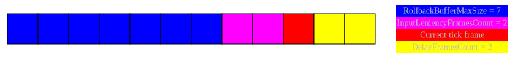

# GGNoRe-CPP-API-IntegrationsTest

Tests and documentation for the rollback module GGNoRe.

- [The problem](#The-problem)
- [The solutions](#The-solutions)
- [More on rollback](#More-on-rollback)
- [Why use GGNoRe](#Why-use-GGNoRe)
- [In this repository](#In-this-repository)
- [Features](#Features)
- [Building](#Building)
  - [Windows](##Windows)
  - [Others](##Others)
- [Buffer structure example](#Buffer-structure-example)
- [Logic overview](#Logic-overview)
  - [Simulation](##Simulation)
  - [Rollback](##Rollback)
- [TBD](#TBD)

## The problem

Online video games are made of 3 parts looping until you stop playing:
1. poll local and **remote** inputs
2. simulate new state
3. render frame
But you cannot poll the **remote** inputs for the current local frame because it takes time for them to travel the network.

## The solutions

- Local client in **lockstep** with remote client:
  1. poll local inputs
  2. the game stalls in order to wait for the remote inputs
  3. simulate and render the frame corresponding with the network travel time delay

Caveats: **lockstep** delays the game by the network travel time and makes it feel sluggish because what is effectively being rendered is what happened in the past.

- Extrapolating then reconciliating the state of a remote player:
  1. poll local inputs
  2. when receiving new information about the remote player state
      - then reconciliate by interpolating between the new information and the faked state
      - otherwise extrapolate according to the most up to date information

Caveats: the state of a player is never exactly the same across different clients which may lead to the different players experiencing different versions of the game and disagreeing on the outcome.

- **Rollback** combines immediate responsiveness with consistency across every client:
  1. poll local inputs
  2. predict the remote inputs (usually by assuming that they are the same as the previous frame, since human beings usually do not press a different button 60 times per second)
  3. generate a checksum from the state of the game
  4. receive the remote inputs and checksum
  5. if the checksum does not match with the local client, we know a mis-prediction occured
      - then load the most recent valid state of the game, aka **rollbacking**, and resimulate up to the current frame with the correct inputs
      - otherwise the prediction was correct and the simulation can continue without delay

Caveats: the part of your game that needs to be rolled back must be fully deterministic, meaning that for given inputs and initial conditions, the simulation outputs the exact same result. This may be impossible for games with complex physics, but many other possibly non deterministic features, such as particles, are not an issue since they are not integral to the outcome of the simulation. Furthermore, your game simulation must be performant enough to run multiple times per frame.

## More on rollback

From the best [writeup](https://ki.infil.net/w02-netcode-p4.html) on the topic:

> Rollback's main strength is that it never waits for missing input from the opponent. Instead, rollback netcode continues to run the game normally. All inputs from the local player are processed immediately, as if it was offline. Then, when input from the remote player comes in a few frames later, rollback fixes its mistakes by correcting the past. It does this in such a clever way that the local player may not even notice a large percentage of network instability, and they can play through any remaining instances with confidence that their inputs are always handled consistently.

For more technical resources, check out the GDC talks from [Overwatch](https://youtu.be/W3aieHjyNvw?t=1341) and [Mortal Kombat](https://www.youtube.com/watch?v=7jb0FOcImdg).

## Why use GGNoRe

- component architecture instead of respectively serializing/simulating everything in a single callback each
- supports transitioning delay based netcode into rollback since you can manage state by simply attaching components to your already existing architecture, and you still may use your regular simulation loop if you can execute it multiple times per frame

## In this repository

There are only the tests in order to demo the API and features, as well as the documentation. The module is in a private repository (see Licensing section at the bottom).

What is in the testing code:
- the entirety of the module is automatically tested with close to [250k different configurations](https://github.com/lvenerosy/GGNoRe-CPP-API-IntegrationsTest/blob/main/GGNoRe-CPP-API-IntegrationsTest/GGNoRe-CPP-API-IntegrationsTest.hpp#L81-L100)
- compute [situations](https://github.com/lvenerosy/GGNoRe-CPP-API-IntegrationsTest/blob/main/GGNoRe-CPP-API-IntegrationsTest/GGNoRe-CPP-API-IntegrationsTest.cpp#L19-L44) to ensure that the test unfolds in a way that corresponds to the configuration
- a [player class](https://github.com/lvenerosy/GGNoRe-CPP-API-IntegrationsTest/blob/main/GGNoRe-CPP-API-IntegrationsTest/TEST_Player.hpp#L29-L31) showing how to use the components
- a [fireball class](https://github.com/lvenerosy/GGNoRe-CPP-API-IntegrationsTest/blob/main/GGNoRe-CPP-API-IntegrationsTest/TEST_Fireball.hpp#L23-L25) spawned by the player class through preset inputs in order to test proper lifetime management when rollbacking before spawn/despawn
- a [mock class](https://github.com/lvenerosy/GGNoRe-CPP-API-IntegrationsTest/blob/main/GGNoRe-CPP-API-IntegrationsTest/TEST_SystemMock.hpp#L39) that represents a client which manages a local/remote players pair's activations and inputs transfers according to the configuration
- an example of how a [main loop](https://github.com/lvenerosy/GGNoRe-CPP-API-IntegrationsTest/blob/main/GGNoRe-CPP-API-IntegrationsTest/TEST_SystemMock.hpp#L178-L284) could be implemented/modified in your engine in order to support GGNoRe

## Features

- Highly configurable: delay frames count, input leniency buffer size, rollback buffer size and more.
- Integration tests for demo purposes and manual debugging.
- Very well documented, namely to offer advice on use and to avoid pitfalls.
- Manages actor lifetime with out of the box support for your game's pooling through activation/deactivation interface.
- Supports both fixed update and updating every tick. For example you could use the ticking callback to update animation playing/player location instead of every fixed logic frame. Still, the async tick logic is locked back with the core clock when a fixed logic frame is completed, so animations/locations would match with the actual state of the game.
- Possibility to periodically stall players with frame advantage, mitigating one sided rollback.
- Possibility to periodically skip rendering frames, when punctually GPU bottlenecked for example.
- Optimized bit buffer for the inputs packet.
- Built-in input transfer protocol.
- Synchronizing with an ongoing game session.
- Supports any number of local/remote players.
- Resistant to some types of cheats. At runtime a server could decide what is simulated locally, using a significance manager for example, so a client would not have information that could be misused. And memory tampering cheats would desync the client since the memory content must be identical.
- Although the module uses the STL containers with the default allocator, the heap memory needs are bounded by the configuration so there are no unnecessary allocations. The state serialization/deserialization is the only memory sensitive operation but in this case you may use the optimized containers coming with your engine.
- Beside the STL everything is tailor-made for the module, there are no 3rd party libraries.
- Detailed logs.
- [Offensive programming](https://en.wikipedia.org/wiki/Offensive_programming) style so no bugs go through unnoticed.
- Lean API, only what you need to use is exposed.
- Internally uses fixed point to ensure determinism.
- Can force rollback in order to test if your game still works in the worst case scenario.
- Mock remote players locally.
- Static library but can easily be turned into a dynamic one.

## Building

### Windows

There is a sln for the VS2019 toolchain.

### Others

Since there is very little platform specific code, all contained within `GGNoRe-CPP-API/Core/Build.hpp`, and since I exclusively use standard C++14, it should be cross-platform as well as any compiler friendly.

## Buffer structure example

This is an example, the actual values depend on how you configure the module.

<!---
graphviz
digraph G {
  { 
    node [shape=plaintext fontcolor=silver]
    
    buffer [label=<<TABLE BORDER="0" CELLBORDER="1" CELLSPACING="0">
    <TR>
        <td BGCOLOR="blue" WIDTH="50" HEIGHT="50"></td>
        <td BGCOLOR="blue" WIDTH="50" HEIGHT="50"></td>
        <td BGCOLOR="blue" WIDTH="50" HEIGHT="50"></td>
        <td BGCOLOR="blue" WIDTH="50" HEIGHT="50"></td>
        <td BGCOLOR="blue" WIDTH="50" HEIGHT="50"></td>
        <td BGCOLOR="blue" WIDTH="50" HEIGHT="50"></td>
        <td BGCOLOR="blue" WIDTH="50" HEIGHT="50"></td>
        <td BGCOLOR="fuchsia" WIDTH="50" HEIGHT="50"></td>
        <td BGCOLOR="fuchsia" WIDTH="50" HEIGHT="50"></td>
        <td BGCOLOR="red" WIDTH="50" HEIGHT="50"></td>
        <td BGCOLOR="yellow" WIDTH="50" HEIGHT="50"></td>
        <td BGCOLOR="yellow" WIDTH="50" HEIGHT="50"></td>
    </TR>
    </TABLE>>];
    
    legend [label=<<TABLE BORDER="0" CELLBORDER="0" CELLSPACING="0">
    <TR><td BGCOLOR="blue">RollbackBufferMaxSize = 7</td></TR>
    <TR><td BGCOLOR="fuchsia">InputLeniencyFramesCount = 2</td></TR>
    <TR><td BGCOLOR="red">Current tick frame</td></TR>
    <TR><td BGCOLOR="yellow">DelayFramesCount = 2</td></TR>
    </TABLE>>];
  }
}
--->

`EmulatorInputBufferSize = InputLeniencyFramesCount + Current tick frame`

- rollback is possible up to `Current tick frame - RollbackBufferMaxSize`.
- generating an input at `Current tick frame` saves it to `Current tick frame + DelayFramesCount`.

## Logic overview

- some details, such as how the delay prevents rollbacking, are omitted for clarity.
- "activation change" refers to the start/stop of the entity's serialization/simulation.
- "unsimulated" means that the change in activation for a component happened outside of the implementation of its simulator interface, namely `OnSimulateFrame`/`OnSimulateTick`.

### Simulation

Configured with a logic frame time of 16.6ms.

|Frame|Instruction|Delta time accumulator|
|-|-|-|
|0|Initialize state|0.0|
|0|Serialize state|0.0|
|0|Tick(7.0)|7.0|
|0|Unsimulated|7.0|
|0|Tick(16.6 - 7.0 = 9.6)|19.0|
|0|Simulate frame(16.6)|19.0|
|1|Unsimulated|2.4|
|1|Serialize state|2.4|

### Rollback

|Frame|Instruction|
|-|-|
|1|Receive remote inputs or a change in activation for frame 0|
|1|Revert activation changes from simulating frame 1|
|1|Revert activation changes from ticking frame 1|
|1|Revert unsimulated activation changes of frame 1|
|1|Revert activation changes from simulating frame 0|
|1|Revert activation changes from ticking frame 0|
|1|Deserialize state of frame 0|
|0|Resimulate|

## TBD

- Visual debug inspector.
- Unreal Engine 4/5 plugins.
- Option to keep simulating even if starved for inputs. That way it would be possible to combine rollback with repairing the state like using regular interpolation netcode. It could also be used to combine rollback for highly relevant players and a more lenient solution for the remaining ones.
- At the moment every player of a session must use the same frame buffer configuration (delay, leniency...). In the future, it might be configurable per player.
- Variable rollback buffer size.

## Licensing

Contact me: contact@erebnyx.com